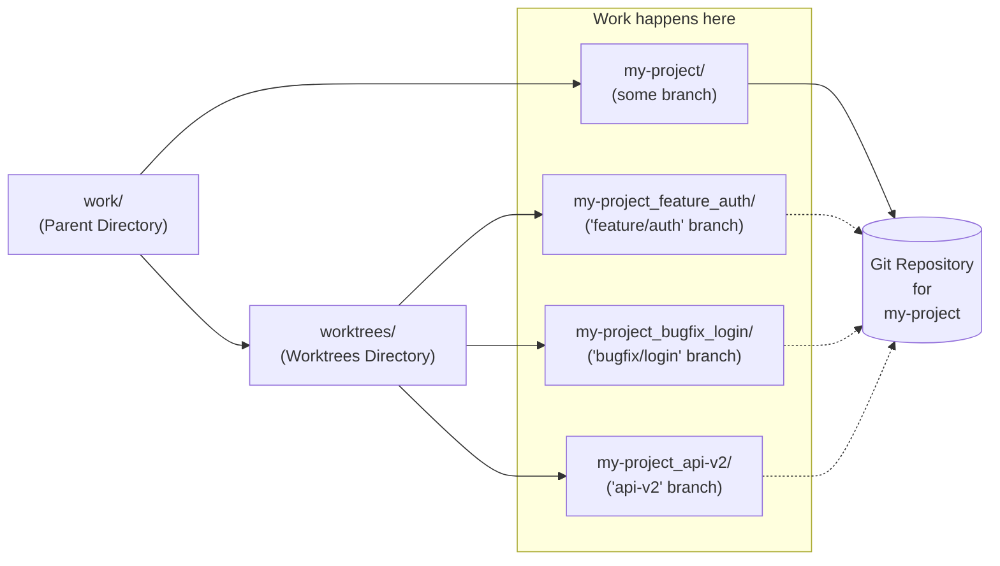

# GWM - Git Worktree Manager

GWM (Git Worktree Manager) is a command-line tool that simplifies the management of Git worktrees, enabling parallel
development sessions on the same Git repository. It's designed for both manual worktree workflows and AI-assisted
development scenarios where multiple tool instances work in parallel on different features.

I created GWM to streamline my own development process, allowing me to easily switch between multiple worktrees for
different features and bug fixes without the hassle of managing Git commands manually. GWM automates directory
navigation, file copying, and hook execution, hopefully making it a powerful tool for developers looking to enhance
their productivity.

The diagram below shows the typical directory structure when using GWM:



The "worktrees" directory is shared among all projects in the parent directory, hiding the complexity of the individual
worktree paths. When working on multiple projects, GWM only considers the worktree directories of the current Git
repository.

Note that because GWM updates the shell environment by switching directories, GWM requires shell integration via wrapper
functions. Carefully follow the Shell Integration instructions below to set it up correctly.

Issues and feature requests are welcome on the [GitHub repository](

<a href="https://www.buymeacoffee.com/software101" target="_blank"></a>

## Features

- 🌳 **Simplified Worktree Management**: Create, switch, and delete worktrees with intuitive commands
- 🚀 **Automatic Directory Navigation**: Seamlessly switch between worktrees and main repository
- 🔧 **Configurable Hooks**: Automate workflows with pre/post hooks for worktree operations
- 📁 **File/Directory Copying**: Copy local files and directories to all worktrees automatically
- 💻 **Cross-Platform Support**: Works on Windows, Linux, and macOS
- 🔍 **Interactive Selection**: Use fuzzy finder (fzf) or built-in selector for worktree navigation
- ⚙️ **Configuration System**: Global, per-repository, and local configurations with JSON/YAML support

## Installation

### Prerequisites

- 📦 Git 2.5+ (for worktree support)
- 🎯 Dart SDK (for building GWM)
- 🔍 Optional: [fzf](https://github.com/junegunn/fzf) for enhanced interactive selection

### Building the Executable

1. 🔽 Clone the repository:
   ```bash
   git clone https://github.com/timovandeput/gwm.git
   cd gwm
   ```

2. 🏗️ Build the executable:
   ```bash
   dart compile exe bin/gwm.dart -o gwm
   ```

3. ➡️ Move the executable to your PATH:
   ```bash
   # Linux/macOS
   chmod +x gwm
   sudo mv gwm /usr/local/bin/

   # Windows
   # Add gwm.exe to your PATH or move to a directory in PATH
   ```

## Shell Integration

GWM requires shell integration for automatic directory switching. This consists of:

- **Required**: A wrapper function that executes GWM commands within `eval` for automatic directory navigation
- **Optional**: Tab completion setup for enhanced command-line experience

> [!IMPORTANT]
> GWM detects when it's running inside a shell `eval` context using the `GWM_EVAL` environment variable. The shell
> wrapper functions set this variable before executing `eval`, which tells GWM to enable eval output for automatic
> directory switching. Without this detection, GWM defaults to not outputting eval commands.

### Bash 🐚

Add to `~/.bashrc`:

```bash
# Wrapper for automatic directory switching
gwm() { export GWM_EVAL=1; eval "$(command gwm "$@")"; }

# Tab completion
source /path/to/gwm/completions/gwm.bash
```

After setup, reload your shell configuration:

```bash
# Bash
source ~/.bashrc
```

### Zsh 🦓

Set up the completions support once:

```bash
# Create completions directory if it doesn't exist
mkdir -p ~/.zsh/completions

# Copy the completion script
cp path/to/gwm/completions/gwm.zsh ~/.zsh/completions/_gwm
````

Add to `~/.zshrc`:

```bash
# Wrapper for automatic directory switching
gwm() { export GWM_EVAL=1; eval "$(command gwm "$@")" }

# Add to your fpath
fpath=(~/.zsh/completions $fpath)

# Load completions
autoload -Uz compinit && compinit
```

After setup, reload your shell configuration:

```bash
# Zsh
source ~/.zshrc
```

### Fish 🐠

Prepare completions support once:

```bash
cp /path/to/gwm/completions/gwm.fish ~/.config/fish/completions/gwm.fish
```

Add to `~/.config/fish/config.fish`:

```fish
# Wrapper for automatic directory switching
function gwm
    set -x GWM_EVAL 1
    eval (command gwm $argv)
end
```

After setup, reload your shell configuration:

```bash
source ~/.config/fish/config.fish
```

### PowerShell 💻

Add to your PowerShell profile (`$PROFILE`):

```powershell
# Wrapper for automatic directory switching
function gwm { $env:GWM_EVAL = '1'; Invoke-Expression (& gwm $args) }
```

### Nushell 🦀

Add to `~/.config/nushell/config.nu`:

```nu
# Wrapper for automatic directory switching
def --env gwm [...args] {
    $env.GWM_EVAL = '1'
    ^gwm ...$args | lines | each { |line| nu -c $line }
}
```

## Quick Start

(Use `-h` or `--help` with any command to see detailed usage information)

```bash
# Create a worktree with a new branch 🌳
gwm add -b feature/new-ui

# List all worktrees 📋
gwm list -v

# Switch to an existing worktree (interactive) 🔄
gwm switch

# Switch to a named worktree 🎯
gwm switch new-ui

# Switch to the main repo 🏠
gwm switch .

# Delete current worktree and return to main repo 🧹
gwm delete

# Delete worktree despite uncommitted changes 💪
gwm delete --force

# Delete the new-ui worktree from the main workspace 🗑️
gwm delete new-ui
```

## Configuration

GWM supports configuration at three levels:

### Configuration locations

* Global: `~/.config/gwm/config.json` (or `.yaml`) applies to all repositories.
* Per-repository: `.gwm.json` (or `.yaml`) in repository root applies to that repository.
* Per-repository local: `.gwm.local.json` (or `.yaml`) in repository root applies only locally. (Should be gitignored.)

### Configuration file format

Configuration files can be in JSON or YAML format. GWM automatically detects the format based on the file extension.

```json
{
  "copy": {
    "files": [
      ".env",
      "*.env.*"
    ],
    "directories": [
      "node_modules",
      ".cache"
    ]
  },
  "hooks": {
    "timeout": 60,
    "post_add": [
      "npm install",
      "npm run build"
    ],
    "post_switch": "npm run dev",
    "pre_delete": "git stash"
  },
  "shell_integration": {
    "enable_eval_output": true
  }
}
```

The `copy` section allows for copying files and directories from the current directory to a new created worktree. Use
this to copy git-ignored local configuration files or large directories like `node_modules` to each worktree. The file
and directory specification supports glob patterns (`*` and `**`) for flexible matching.

The `hooks` section allows defining shell commands that run at specific points during worktree operations.
Hooks are defined for `pre_add`, `post_add`, `pre_switch`, `post_switch`, `pre_delete`, and `post_delete` events. By
appending `_prepend` or `_append` to the hook name, you can add commands to the beginning or end of the hook instead of
overriding it.

The command invocation can be either specified as a string or as an array of strings for multiple sequential
commands. The `timeout` field sets hook execution timeout in seconds (default: 30 seconds).

Hooks are shell commands that run at specific points during worktree operations. Environment variables provide access to
the worktree and origin paths:

| Hook          | When Executed                          | Environment Variables                  |
|---------------|----------------------------------------|----------------------------------------|
| `pre_add`     | Before creating worktree               | `GWM_WORKTREE_PATH`, `GWM_ORIGIN_PATH` |
| `post_add`    | After creating worktree                | `GWM_WORKTREE_PATH`, `GWM_ORIGIN_PATH` |
| `pre_switch`  | Before switching worktree              | `GWM_WORKTREE_PATH`, `GWM_ORIGIN_PATH` |
| `post_switch` | After switching worktree               | `GWM_WORKTREE_PATH`, `GWM_ORIGIN_PATH` |
| `pre_delete`  | Before deleting worktree               | `GWM_WORKTREE_PATH`, `GWM_ORIGIN_PATH` |
| `post_delete` | After deleting worktree (in main repo) | `GWM_ORIGIN_PATH`                      |

The `shell_integration` field allows for overriding the shell integration behavior and defaults to the `GWM_EVAL`
environment variable being set.

## Directory Structure 📂

GWM creates worktrees in a shared directory structure:

```
~/work/
├── project/               # Main Git repository
│   ├── .gwm.json          # Repository-specific configuration
│   ├── .gwm.local.json    # Local-only configuration (gitignored)
│   └── ...                # Repository files
└── worktrees/             # Shared worktree directory
    ├── project_feature-auth/
    ├── project_bugfix-login/
    └── project_api-v2/
```

**Key Points:**

- The `worktrees` directory is in the parent directory of the Git workspace
- Multiple Git repositories share the same `worktrees` directory
- Worktree names: `<repo-name>_<branch-name>`
- Worktrees are never created inside Git workspace directories

## Workflows

### Basic Workflow ⚡

```bash
# Create worktree with new branch 🌳
gwm add -b feature/new-ui

# Work on feature...
# Directory is already switched by gwm add

# Clean up when done 🧹
gwm delete 
```

### Multi-Feature Workflow 🔀

```bash
# Create multiple worktrees 🌳
gwm add feature/auth
gwm add feature/api
gwm add bugfix/login

# Switch between worktrees 🔄
gwm switch feature-auth

# Switch back to main workspace 🏠
gwm switch .

# List all worktrees 📋
gwm list -v
```

### AI-Assisted Development 🤖

```bash
# Terminal 1: Work on authentication 🤖
gwm add feature/auth

# Terminal 2: Work on API 🤖
gwm switch feature-api

# Terminal 3: Work on bugfix 🤖
gwm switch bugfix-login

# Terminal 4: Monitor from main workspace 👁
gwm switch .
gwm list -v
```

## Exit Codes 📊

| Code | Meaning                                             |
|------|-----------------------------------------------------|
| 0    | ✅ Success                                           |
| 1    | ❌ General error                                     |
| 2    | ❌ Invalid usage (wrong arguments)                   |
| 3    | ❌ Worktree already exists                           |
| 4    | ❌ Branch not found                                  |
| 5    | ❌ Hook execution failed                             |
| 6    | ❌ Configuration error                               |
| 7    | ❌ Git command failed                                |
| 8    | ❌ Shell wrapper missing or not configured           |
| 9    | ❌ Worktree already exists but successfully switched |

## Development

### Build Commands 🏗️

```bash
# Run application
dart run bin/gwm.dart

# Build executable
dart compile exe bin/gwm.dart -o gwm
```

### Lint Commands 🔍

```bash
# Run static analysis
dart analyze

# Format code
dart format .

# Format with changes check
dart format --set-exit-if-changed .
```

### Test Commands 🧪

```bash
# Run all tests
dart test

# Run specific test file
dart test test/file_test.dart

# Run single test by name
dart test -n "test name"

# Run tests with coverage
dart test --coverage=coverage
```

### Development Workflow 💻

1. ✏️ Make changes to code
2. 🎨 Format: `dart format .`
3. 🔍 Lint: `dart analyze`
4. 🧪 Test: `dart test`
5. ▶️ Run: `dart run bin/gwm.dart --help` to verify functionality

## Troubleshooting 🔧

### Worktree creation fails with "branch not found" ❌

Use `-b` flag to create a new Git branch before creating the worktree:

```bash
gwm add -b feature/new-ui
```

### Automatic directory switching doesn't work ⚠️

Ensure shell wrapper is installed (see Shell Integration section above).

### Files not copied to worktree 📁

Check `copy` configuration in `.gwm.json` and `.gwm.local.json` and verify file paths exist in main repository.

### Hook execution fails ❌

GWM will display the error output from the failed command. Review the output to understand the failure, fix the issue,
and retry.

## Contributing 🤝

Contributions are welcome! Please see [AGENTS.md](AGENTS.md) for development guidelines and coding standards.

## License 📄

MIT License. See [LICENSE](LICENSE) for details.

## Links 🔗

- [📋 PRD](PRD.md) - Product Requirements Document
- [👨‍💻 AGENTS.md](AGENTS.md) - Development Guidelines
- [🔗 GitHub Repository](https://github.com/yourusername/gwm)
