# GWM Architecture Design Document

## 1. Overview

GWM (Git Worktree Manager) is a command-line tool built in Dart that simplifies Git worktree management. This document
outlines the software architecture, component design, data flows, and testing strategy.

## 2. Technology Stack

### 2.1 Dart SDK Built-ins

- `dart:io` - File system operations, process spawning, platform detection
- `dart:async` - Async operations and Future handling
- `dart:convert` - JSON encoding/decoding

## 2. Architecture Layers

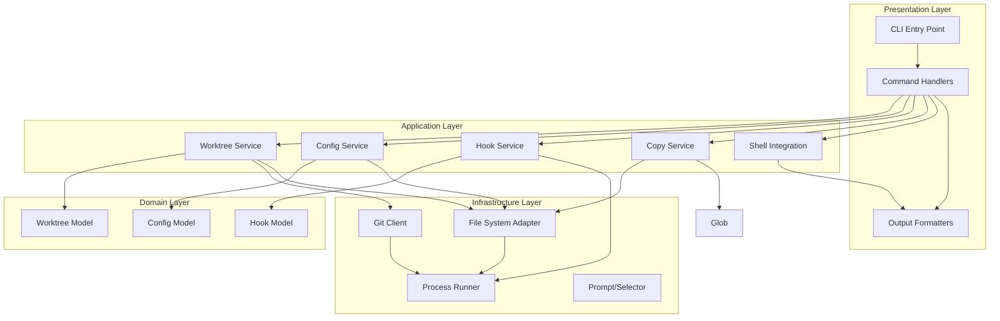

## 3. Directory Structure

```
gwm/
├── bin/
│   └── gwm.dart                  # Main CLI entry point
├── lib/
│   ├── src/
│   │   ├── commands/             # Command handlers
│   │   ├── services/             # Business logic
│   │   ├── models/               # Domain models
│   │   ├── infrastructure/       # External integrations
│   │   ├── utils/                # Utilities
│   │   └── exceptions.dart       # Custom exceptions
│   └── gwm.dart                  # Library entry point
├── test/
│   ├── unit/                     # Unit tests
│   ├── integration/              # Integration tests
│   ├── fixtures/                 # Test fixtures
│   └── mock_objects/             # Test doubles
└── docs/
    ├── PRD.md
    ├── ARCHITECTURE.md           # This file
    └── TESTING.md
```

## 4. Core Components

### 4.1 Command Handlers

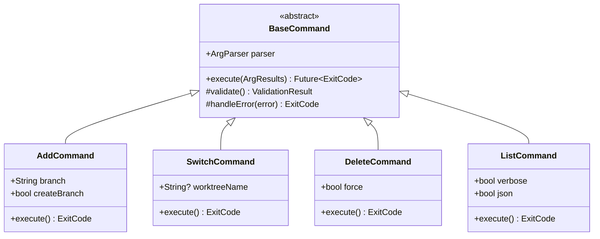

### 4.2 Worktree Service

The `WorktreeService` orchestrates worktree operations.


### 4.3 Configuration Service

The `ConfigService` manages configuration loading with the 3-tier hierarchy:

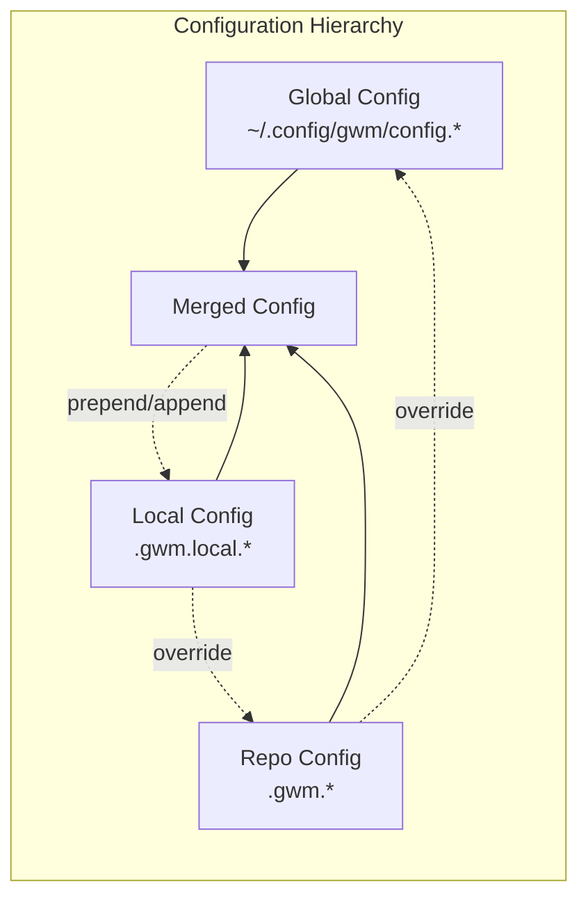

**Configuration Merging Logic:**

1. Load global config (lowest priority)
2. Load repo config, override global settings
3. Load local config, apply override strategies:
    - Direct field: Complete override
    - `_prepend`: Add items before existing list
    - `_append`: Add items after existing list

### 4.4 Hook Service

The `HookService` executes shell commands with proper error handling:

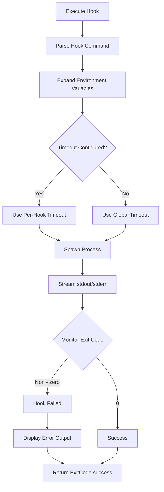

**Hook Execution Rules:**

- Execute commands sequentially
- Stop immediately on first failure
- Display all output (stdout + stderr)
- Terminate on timeout
- Exit with code 5 on failure

### 4.5 Copy Service

The `CopyService` handles file/directory copying with CoW optimization:

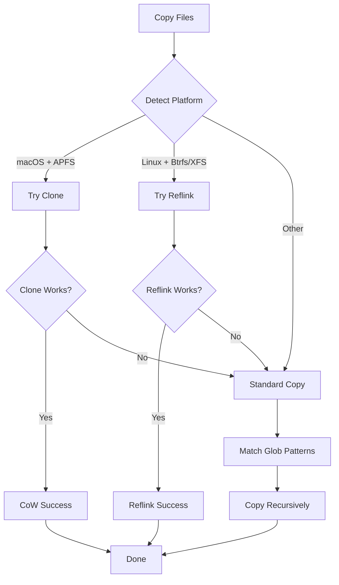

### 4.6 Git Client

The `GitClient` wraps all Git CLI operations:

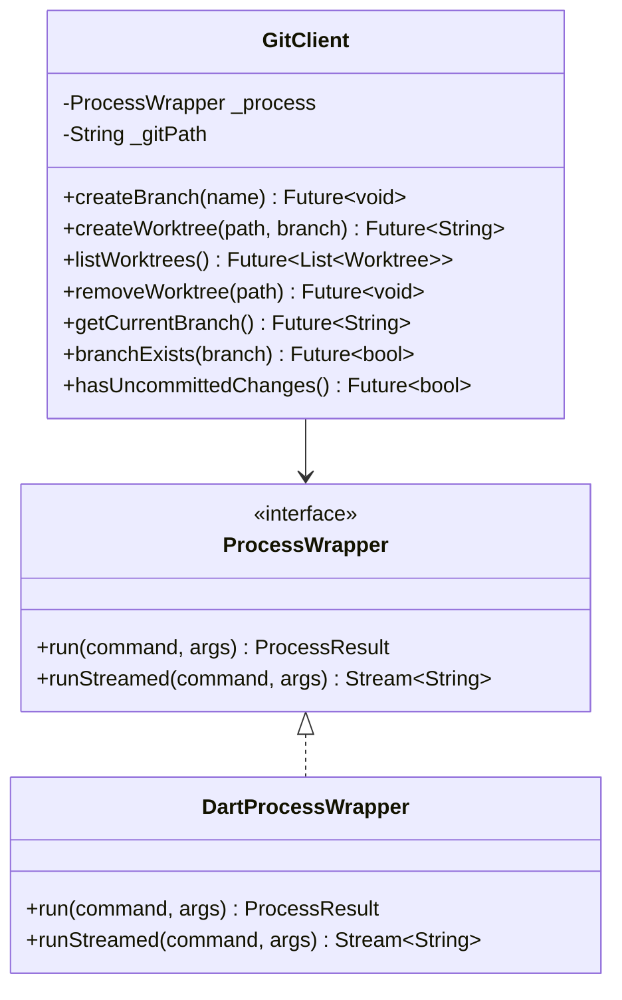

### 4.7 Shell Integration

Shell integration uses eval-output for directory switching:

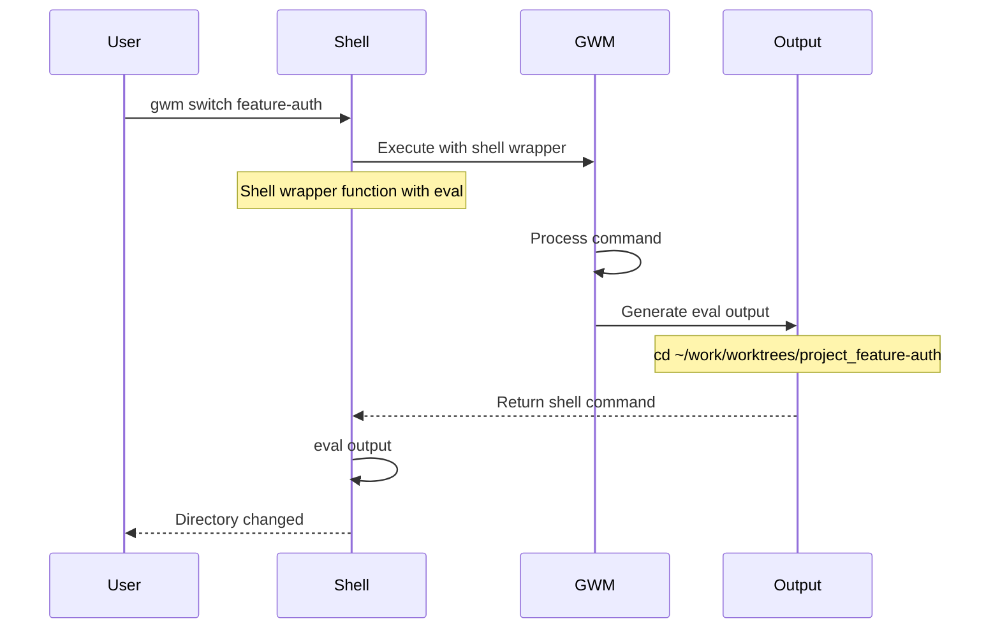

## 5. Data Models

### 6.1 Worktree Model

The Worktree model represents a Git worktree with properties for name, branch, path, status, and timestamps. See `lib/src/models/worktree.dart` for the complete class definition.

### 6.2 Configuration Model

The configuration system uses hierarchical loading with global, repo, and local configs. It includes settings for copy operations, hooks, and shell integration. See `lib/src/models/config.dart` for the complete configuration model definitions.

## 6. Error Handling

### 6.1 Exception Hierarchy

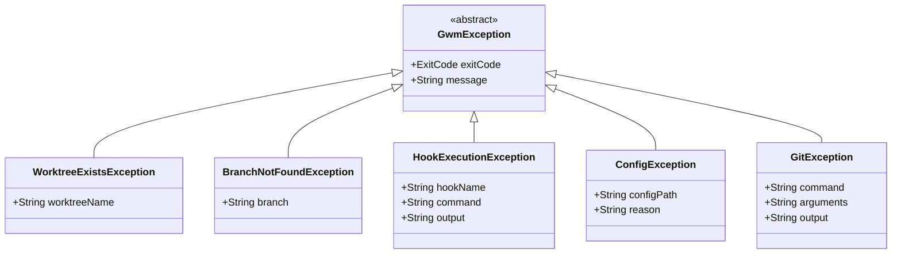

### 6.2 Error Recovery Strategy

The PRD specifies: **Leave partial state with clear error message**

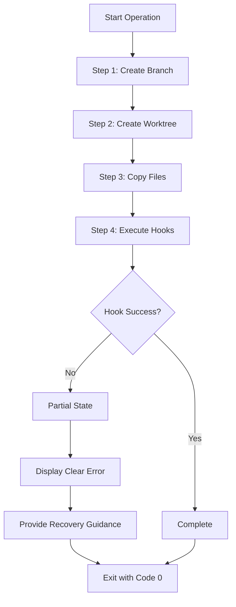

**Recovery Guidance Examples:**

- Hook failed: `npm install exited with status 1` → Run manually or fix issue and retry
- Git failed: `branch not found` → Use `-b` flag to create branch
- Copy failed: `Source file not found` → Check config and source path

## 7. Testing Strategy

### 7.1 Testing Philosophy

**Core Principle: Never invoke actual external tools in tests**

All tests use test doubles and mocks to ensure:

- Fast test execution
- Deterministic behavior
- Cross-platform test consistency
- No side effects on user environment

### 7.2 Test Pyramid

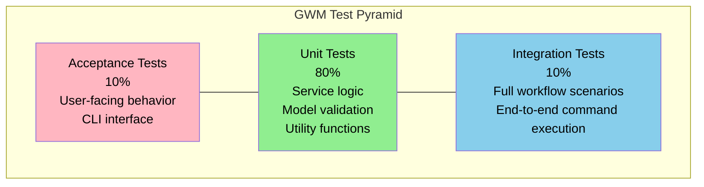

### 7.3 Unit Testing

Unit tests focus on individual components with mocked dependencies. External tools like Git and file system operations are mocked to avoid side effects.

### 7.4 Integration Testing

Integration tests verify end-to-end command workflows using fake implementations for all external dependencies.

### 7.5 Test Coverage Goals

| Component      | Target Coverage |
|----------------|-----------------|
| Commands       | 90%+            |
| Services       | 95%+            |
| Models         | 100%            |
| Infrastructure | 90%+            |
| Utils          | 95%+            |
| Overall        | 90%+            |

### 7.6 Running Tests

```bash
# Run all tests
dart test

# Run with coverage
dart test --coverage=coverage

# Run unit tests only
dart test test/unit/

# Run integration tests only
dart test test/integration/

# Run specific test
dart test test/unit/services/worktree_service_test.dart

# Run tests matching pattern
dart test -n "add worktree"
```

## 8. Cross-Platform Considerations

### 8.1 Platform Detection

Platform detection identifies the operating system to enable appropriate filesystem and process handling. See `lib/src/infrastructure/platform_detector.dart` for platform detection logic.

### 8.2 Path Handling

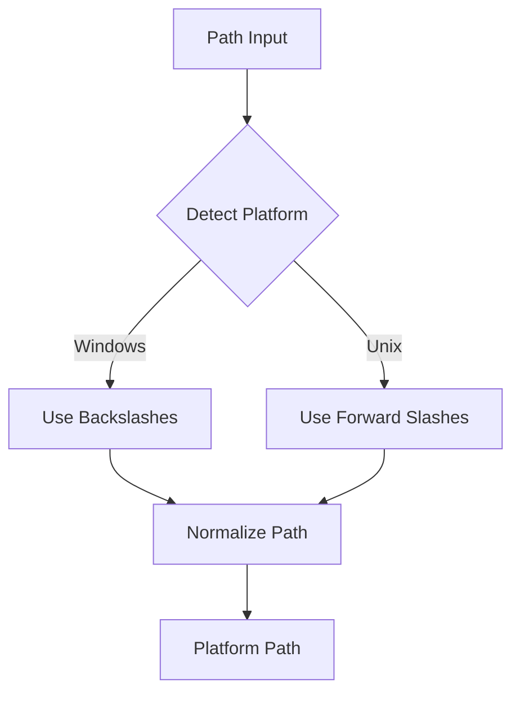

### 8.3 Shell Detection

Shell detection automatically identifies the user's shell environment for proper command execution. See `lib/src/utils/shell_detector.dart` for the shell detection implementation.

## 9. Security Considerations

### 9.1 Command Injection Prevention

Input validation prevents command injection by rejecting dangerous shell metacharacters and path traversal attempts. See `lib/src/utils/validation.dart` for command validation logic.

### 9.2 Path Validation

Path validation ensures all file operations stay within allowed directories to prevent directory traversal attacks. See `lib/src/utils/validation.dart` for path validation utilities.

### 9.3 Config Validation

Configuration validation ensures all settings are within safe bounds, including timeout limits and safe glob patterns. See `lib/src/utils/validation.dart` for configuration validation logic.

## 10. Performance Optimization

### 10.1 Copy-on-Write Detection

Copy operations automatically detect filesystem capabilities to use efficient copy-on-write techniques where available (APFS clone on macOS, reflink on Linux). See `lib/src/services/copy_service.dart` for copy strategy selection.

### 10.2 Lazy Configuration Loading

Configuration loading uses lazy initialization and caching to minimize I/O operations during repeated access. See `lib/src/services/config_service.dart` for configuration loading implementation.


