# GWM Architecture Design Document

## 1. Overview

GWT (Git Worktree Manager) is a command-line tool built in Dart that simplifies Git worktree management. This document
outlines the software architecture, component design, data flows, and testing strategy.

## 2. Technology Stack

### 2.1 Core Dependencies

| Package          | Version | Purpose                                   |
|------------------|---------|-------------------------------------------|
| `args`           | ^2.7.0  | Command-line argument parsing             |
| `yaml`           | ^3.1.0  | YAML configuration file parsing           |
| `glob`           | ^2.1.0  | File pattern matching for copy operations |
| `process_runner` | ^4.2.0  | Process execution with test fakes         |
| `path`           | ^1.9.0  | Path manipulation                         |

### 2.2 Dart SDK Built-ins

- `dart:io` - File system operations, process spawning, platform detection
- `dart:async` - Async operations and Future handling
- `dart:convert` - JSON encoding/decoding

## 3. Architecture Layers

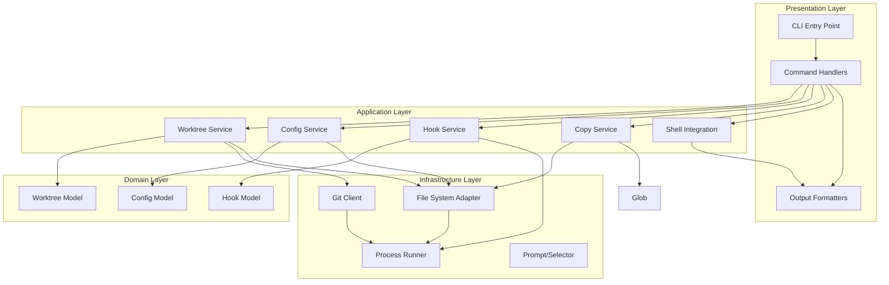

## 4. Directory Structure

```
gwt/
├── bin/
│   └── gwt.dart                  # Main entry point
├── lib/
│   ├── src/
│   │   ├── commands/             # Command handlers
│   │   │   ├── add.dart
│   │   │   ├── switch.dart
│   │   │   ├── clean.dart
│   │   │   ├── list.dart
│   │   │   └── base.dart        # Base command interface
│   │   ├── services/             # Business logic
│   │   │   ├── worktree_service.dart
│   │   │   ├── config_service.dart
│   │   │   ├── hook_service.dart
│   │   │   ├── copy_service.dart
│   │   │   └── shell_integration.dart
│   │   ├── models/               # Domain models
│   │   │   ├── worktree.dart
│   │   │   ├── config.dart
│   │   │   ├── hook.dart
│   │   │   └── exit_codes.dart
│   │   ├── infrastructure/        # External integrations
│   │   │   ├── git_client.dart
│   │   │   ├── file_system_adapter.dart
│   │   │   ├── process_wrapper.dart
│   │   │   ├── prompt_selector.dart
│   │   │   └── platform_detector.dart
│   │   ├── utils/                # Utilities
│   │   │   ├── path_utils.dart
│   │   │   ├── validation.dart
│   │   │   └── output_formatter.dart
│   │   └── exceptions.dart        # Custom exceptions
│   └── gwt.dart                  # Library entry point
├── test/
│   ├── unit/                     # Unit tests
│   │   ├── commands/
│   │   ├── services/
│   │   ├── models/
│   │   ├── infrastructure/
│   │   └── utils/
│   ├── integration/              # Integration tests
│   │   └── worktree_flow_test.dart
│   ├── fixtures/                 # Test fixtures
│   │   ├── mock_configs/
│   │   └── fake_git_repo/
│   └── mock_objects/             # Test doubles
│       ├── fake_process_runner.dart
│       ├── fake_file_system.dart
│       └── mock_git_client.dart
└── docs/
    ├── PRD.md
    ├── ARCHITECTURE.md           # This file
    └── TESTING.md
```

## 5. Core Components

### 5.1 Command Handlers

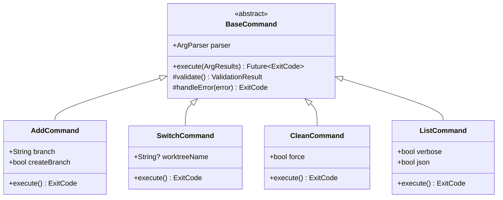

### 5.2 Worktree Service

The `WorktreeService` orchestrates worktree operations.


### 5.3 Configuration Service

The `ConfigService` manages configuration loading with the 3-tier hierarchy:

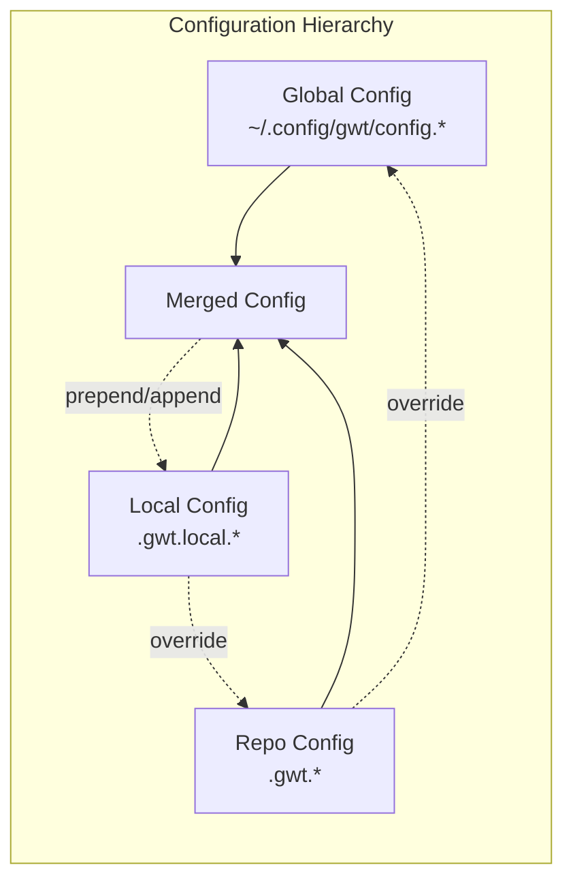

**Configuration Merging Logic:**

1. Load global config (lowest priority)
2. Load repo config, override global settings
3. Load local config, apply override strategies:
    - Direct field: Complete override
    - `_prepend`: Add items before existing list
    - `_append`: Add items after existing list

### 5.4 Hook Service

The `HookService` executes shell commands with proper error handling:

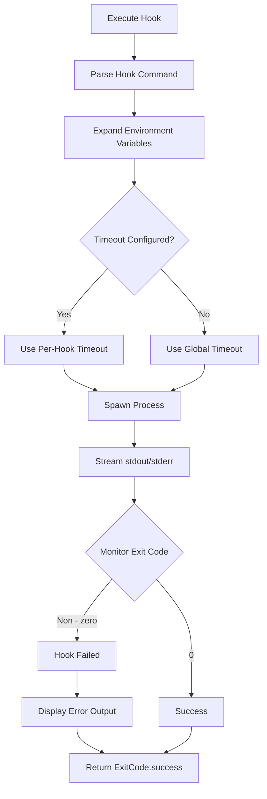

**Hook Execution Rules:**

- Execute commands sequentially
- Stop immediately on first failure
- Display all output (stdout + stderr)
- Terminate on timeout
- Exit with code 5 on failure

### 5.5 Copy Service

The `CopyService` handles file/directory copying with CoW optimization:

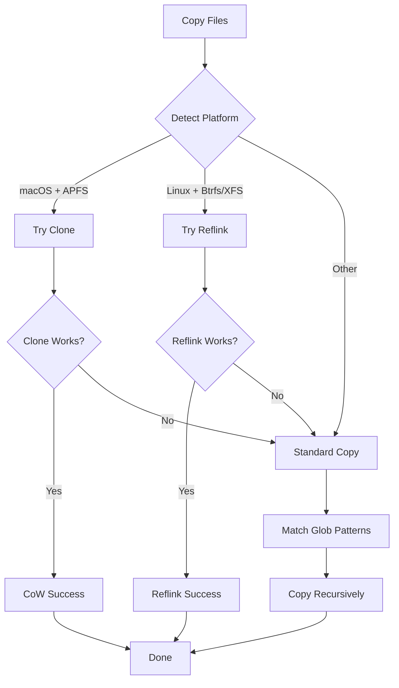

### 5.6 Git Client

The `GitClient` wraps all Git CLI operations:

```mermaid
classDiagram
    class GitClient {
        -ProcessWrapper _process
        -String _gitPath
        +createBranch(name) Future~void~
        +createWorktree(path, branch) Future~String~
        +listWorktrees() Future~List~Worktree~~
        +removeWorktree(path) Future~void~
        +getCurrentBranch() Future~String~
        +branchExists(branch) Future~bool~
        +hasUncommittedChanges() Future~bool~
    }

    class ProcessWrapper {
        <<interface>>
        +run(command, args, {timeout}) ProcessResult
        +runStreamed(command, args) Stream~String~
    }

    class DartProcessWrapper {
        +run(command, args) ProcessResult
        +runStreamed(command, args) Stream~String~
    }

GitClient --> ProcessWrapper
ProcessWrapper <|.. DartProcessWrapper
```

### 5.7 Shell Integration

Shell integration uses eval-output for directory switching:

```mermaid
sequenceDiagram
    participant User
    participant Shell
    participant GWM
    participant Output
    User ->> Shell: gwm switch feature-auth
    Shell ->> GWM: Execute with shell wrapper
    Note over Shell: gwt() { eval "$(command gwm $@")"; }
    GWM->>GWT: Process command
    GWM->>Output: Generate eval output
    Note over Output: cd ~/work/worktrees/project_feature-auth
    Output-->>Shell: Return shell command
    Shell->>Shell: eval output
    Shell-->>User: Directory changed
```

## 6. Data Models

### 6.1 Worktree Model

```dart
class Worktree {
  final String name; // Worktree name (e.g., "feature-auth")
  final String branch; // Git branch (e.g., "feature/auth")
  final String path; // Absolute path
  final bool isMain; // Is main workspace?
  final WorktreeStatus status;
  final DateTime? lastModified;
}

enum WorktreeStatus {
  clean,
  modified,
  ahead,
  detached,
}
```

### 6.2 Configuration Model

```dart
class Config {
  final String version;
  final CopyConfig copy;
  final HooksConfig hooks;
  final ShellIntegrationConfig shellIntegration;
}

class CopyConfig {
  final List<String> files;
  final List<String> directories;
}

class HooksConfig {
  final int timeout;
  final List<String>? preAdd;
  final List<String>? postAdd;
  final List<String>? preSwitch;
  final List<String>? postSwitch;
  final List<String>? preClean;
  final List<String>? postClean;
}

class ShellIntegrationConfig {
  final bool enableEvalOutput;
}
```

## 7. Error Handling

### 7.1 Exit Codes

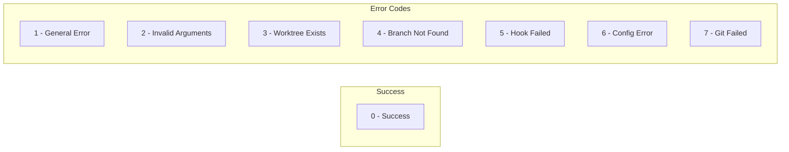

### 7.2 Exception Hierarchy

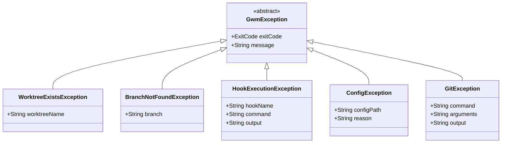

### 7.3 Error Recovery Strategy

The PRD specifies: **Leave partial state with clear error message**

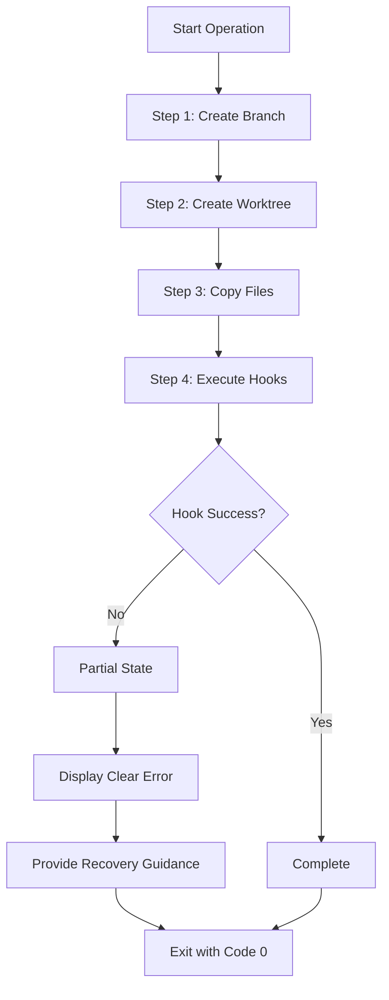

**Recovery Guidance Examples:**

- Hook failed: `npm install exited with status 1` → Run manually or fix issue and retry
- Git failed: `branch not found` → Use `-b` flag to create branch
- Copy failed: `Source file not found` → Check config and source path

## 8. Testing Strategy

### 8.1 Testing Philosophy

**Core Principle: Never invoke actual external tools in tests**

All tests use test doubles and mocks to ensure:

- Fast test execution
- Deterministic behavior
- Cross-platform test consistency
- No side effects on user environment

### 8.2 Test Pyramid


### 8.3 Unit Testing

#### 8.3.1 Test Doubles

All external dependencies are mocked using interfaces:

```dart
// Interface for process execution
abstract class ProcessWrapper {
  Future<ProcessResult> run(String command,
      List<String> arguments, {
        Duration? timeout,
        String? workingDirectory,
      });

  Stream<String> runStreamed(String command,
      List<String> arguments, {
        String? workingDirectory,
      });
}

// Fake implementation for testing
class FakeProcessWrapper implements ProcessWrapper {
  final Map<String, _CommandResult> _responses;

  FakeProcessWrapper({Map<String, _CommandResult>? responses})
      : _responses = responses ?? {};

  void addResponse(String command, List<String> args, {
    int exitCode = 0,
    String stdout = '',
    String stderr = '',
  }) {
    _responses[_key(command, args)] = _CommandResult(
      exitCode: exitCode,
      stdout: stdout,
      stderr: stderr,
    );
  }

  @override
  Future<ProcessResult> run(String command,
      List<String> arguments, {
        Duration? timeout,
        String? workingDirectory,
      }) async {
    final key = _key(command, arguments);
    final response = _responses[key];

    if (response == null) {
      throw AssertionError('No mock response for: $key');
    }

    return ProcessResult(
      0,
      response.exitCode,
      response.stdout,
      response.stderr,
    );
  }

// ... runStreamed implementation
}

class _CommandResult {
  final int exitCode;
  final String stdout;
  final String stderr;
}
```

#### 8.3.2 Example Unit Test

```dart
// test/unit/services/worktree_service_test.dart

import 'package:test/test.dart';
import 'package:mockito/mockito.dart';
import 'package:mockito/annotations.dart';

import 'package:gwm/src/models/worktree.dart';
import 'package:gwm/src/models/exit_codes.dart';
import 'package:gwm/src/services/worktree_service.dart';
import 'package:gwm/src/infrastructure/git_client.dart';
import 'package:gwm/src/infrastructure/file_system_adapter.dart';

import 'worktree_service_test.mocks.dart';

@GenerateMocks([GitClient, FileSystemAdapter])
void main() {
  group('WorktreeService', () {
    late WorktreeService service;
    late MockGitClient mockGitClient;
    late MockFileSystemAdapter mockFileSystem;

    setUp(() {
      mockGitClient = MockGitClient();
      mockFileSystem = MockFileSystemAdapter();
      service = WorktreeService(
        gitClient: mockGitClient,
        fileSystem: mockFileSystem,
      );
    });

    group('add', () {
      test('creates worktree from existing branch', () async {
        when(mockGitClient.branchExists('feature/auth')).thenAnswer((_) async => true);
        when(mockGitClient.createWorktree(any, 'feature/auth'))
            .thenAnswer((_) async => '/path/to/worktree');

        final result = await service.add(
          branch: 'feature/auth',
          worktreePath: '/path/to/worktree',
        );

        expect(result.isRight(), isTrue);
        verify(mockGitClient.branchExists('feature/auth')).called(1);
        verify(mockGitClient.createWorktree('/path/to/worktree', 'feature/auth')).called(1);
      });

      test('fails when branch does not exist', () async {
        when(mockGitClient.branchExists('feature/auth')).thenAnswer((_) async => false);

        final result = await service.add(
          branch: 'feature/auth',
          worktreePath: '/path/to/worktree',
        );

        expect(result.isLeft(), isTrue);
        result.fold(
              (error) => expect(error.exitCode, equals(ExitCode.branchNotFound)),
              (_) => fail('Expected error'),
        );
      });

      test('fails when worktree already exists', () async {
        when(mockGitClient.branchExists('feature/auth')).thenAnswer((_) async => true);
        when(mockFileSystem.directoryExists('/path/to/worktree')).thenReturn(true);

        final result = await service.add(
          branch: 'feature/auth',
          worktreePath: '/path/to/worktree',
        );

        expect(result.isLeft(), isTrue);
        result.fold(
              (error) => expect(error.exitCode, equals(ExitCode.worktreeExists)),
              (_) => fail('Expected error'),
        );
      });
    });

    group('clean', () {
      test('deletes worktree and returns to main repo', () async {
        when(mockGitClient.removeWorktree('/path/to/worktree'))
            .thenAnswer((_) async {});
        when(mockFileSystem.deleteDirectory('/path/to/worktree'))
            .thenAnswer((_) async {});

        final result = await service.clean(
          currentPath: '/path/to/worktree',
          repoPath: '/path/to/repo',
          force: false,
        );

        expect(result.isRight(), isTrue);
        verify(mockGitClient.removeWorktree('/path/to/worktree')).called(1);
        verify(mockFileSystem.deleteDirectory('/path/to/worktree')).called(1);
      });

      test('prompts for confirmation with uncommitted changes', () async {
        when(mockGitClient.hasUncommittedChanges('/path/to/worktree'))
            .thenAnswer((_) async => true);

        // Prompt would be mocked in real implementation
        final result = await service.clean(
          currentPath: '/path/to/worktree',
          repoPath: '/path/to/repo',
          force: false,
        );

        // Verify prompt was shown
      });
    });
  });
}
```

### 8.4 Error Condition Testing

Every error condition must be tested without external tool invocation:

```dart
group('error conditions', () {
  test('handles git command failures', () async {
    when(mockGitClient.createWorktree(any, any))
        .thenThrow(GitException(
              command: 'git worktree add',
              arguments: ['/path', 'branch'],
              output: 'fatal: Invalid path',
            ));

    final result = await service.add(
      branch: 'feature/auth',
      worktreePath: '/path/to/worktree',
    );

    expect(result.isLeft(), isTrue);
    result.fold(
      (error) {
        expect(error, isA<GitException>());
        expect(error.exitCode, equals(ExitCode.gitFailed));
        expect(error.message, contains('Invalid path'));
      },
      (_) => fail('Expected GitException'),
    );
  });

  test('handles hook execution failures', () async {
    mockHookService.addResponse('post_add', [
      HookCommand(command: 'npm install', exitCode: 1, stderr: 'npm ERR!'),
    ]);

    final result = await service.add(
      branch: 'feature/auth',
      worktreePath: '/path/to/worktree',
    );

    expect(result.isLeft(), isTrue);
    result.fold(
      (error) {
        expect(error, isA<HookExecutionException>());
        expect(error.exitCode, equals(ExitCode.hookFailed));
        expect(error.message, contains('npm install'));
        expect(error.output, contains('npm ERR!'));
      },
      (_) => fail('Expected HookExecutionException'),
    );
  });

  test('handles config parsing errors', () async {
    mockFileSystem.addFile('/path/to/.gwt.json', '{ invalid json }');

    final result = await configService.loadConfig('/path/to/repo');

    expect(result.isLeft(), isTrue);
    result.fold(
      (error) {
        expect(error, isA<ConfigException>());
        expect(error.exitCode, equals(ExitCode.configError));
      },
      (_) => fail('Expected ConfigException'),
    );
  });

  test('handles file copy failures', () async {
    mockFileSystem.addFile('/source/.env', 'KEY=value');
    mockFileSystem.setCopyError('/dest/.env', FileSystemError('Permission denied'));

    final result = await copyService.copyFiles(
      sourceDir: '/source',
      destDir: '/dest',
      patterns: ['.env'],
    );

    expect(result.isLeft(), isTrue);
    result.fold(
      (error) {
        expect(error, isA<FileSystemException>());
      },
      (_) => fail('Expected FileSystemException'),
    );
  });

  test('handles timeout failures', () async {
    mockProcessWrapper.addTimeout('npm install');

    final result = await hookService.execute(
      hookName: 'post_add',
      commands: ['npm install'],
      env: {},
      timeout: Duration(seconds: 5),
    );

    expect(result.isLeft(), isTrue);
    result.fold(
      (error) {
        expect(error, isA<HookExecutionException>());
        expect(error.message, contains('timeout'));
      },
      (_) => fail('Expected timeout error'),
    );
  });
});
```

### 8.5 Integration Testing

Integration tests verify end-to-end workflows with all test doubles:

```dart
// test/integration/worktree_flow_test.dart

import 'package:test/test.dart';

import 'package:gwm/src/commands/add.dart';
import 'package:gwm/src/infrastructure/git_client.dart';
import 'package:gwm/mock_objects/fake_process_runner.dart';

void main() {
  group('Add Command Integration', () {
    late FakeProcessRunner fakeProcess;
    late AddCommand command;

    setUp(() {
      fakeProcess = FakeProcessRunner();
      command = AddCommand(processRunner: fakeProcess);
    });

    test('complete workflow: add worktree with hooks', () async {
      // Setup fake responses
      fakeProcess.addResponse('git', ['branch', '--show-current'],
          stdout: 'main\n');
      fakeProcess.addResponse('git', ['branch', 'feature/auth'],
          stdout: '\n');
      fakeProcess.addResponse('git', ['worktree', 'add', '/path/worktrees/project_feature-auth', 'feature/auth'],
          stdout: 'Preparing worktree (detached HEAD)\n');
      fakeProcess.addResponse('git', ['status', '--porcelain'],
          stdout: '');
      fakeProcess.addResponse('cp', ['-r', '/path/node_modules', '/path/worktrees/project_feature-auth/node_modules'],
          stdout: '');
      fakeProcess.addResponse('npm', ['install'],
          stdout: 'added 123 packages\n');
      fakeProcess.addResponse('npm', ['run', 'build'],
          stdout: 'Build complete\n');

      // Execute
      final exitCode = await command.execute(['feature/auth']);

      // Verify
      expect(exitCode, equals(0));
      expect(fakeProcess.executedCommands.length, equals(7));

      // Verify execution order
      expect(fakeProcess.executedCommands[0], equals(['git', 'branch', '--show-current']));
      expect(fakeProcess.executedCommands[1], equals(['git', 'branch', 'feature/auth']));
      expect(fakeProcess.executedCommands[2], equals(['git', 'worktree', 'add', ...]));
      expect(fakeProcess.executedCommands[5], equals(['npm', 'install']));
      expect(fakeProcess.executedCommands[6], equals(['npm', 'run', 'build']));
    });

    test('workflow fails on hook error and leaves partial state', () async {
      // Setup fake responses
      fakeProcess.addResponse('git', ['branch', '--show-current'],
          stdout: 'main\n');
      fakeProcess.addResponse('git', ['branch', 'feature/auth'],
          stdout: '\n');
      fakeProcess.addResponse('git', ['worktree', 'add', '/path/worktrees/project_feature-auth', 'feature/auth'],
          stdout: 'Preparing worktree\n');
      fakeProcess.addResponse('npm', ['install'],
          stdout: '',
          stderr: 'npm ERR! missing script: install\n',
          exitCode: 1);

      // Execute
      final exitCode = await command.execute(['feature/auth']);

      // Verify failure
      expect(exitCode, equals(5)); // Hook exit code
      expect(fakeProcess.executedCommands.length, equals(4));

      // Verify worktree was created but hook failed
      expect(fakeProcess.executedCommands[2], contains('git worktree add'));
      expect(fakeProcess.executedCommands[3], equals(['npm', 'install']));
    });
  });
}
```

### 8.6 Test Coverage Goals

| Component      | Target Coverage |
|----------------|-----------------|
| Commands       | 90%+            |
| Services       | 95%+            |
| Models         | 100%            |
| Infrastructure | 90%+            |
| Utils          | 95%+            |
| Overall        | 90%+            |

### 8.7 Running Tests

```bash
# Run all tests
dart test

# Run with coverage
dart test --coverage=coverage

# Run unit tests only
dart test test/unit/

# Run integration tests only
dart test test/integration/

# Run specific test
dart test test/unit/services/worktree_service_test.dart

# Run tests matching pattern
dart test -n "add worktree"
```

## 9. Cross-Platform Considerations

### 9.1 Platform Detection

```dart
enum Platform {
  windows,
  macos,
  linux,
}

class PlatformDetector {
  static Platform get current {
    if (Platform.isWindows) return Platform.windows;
    if (Platform.isMacOS) return Platform.macos;
    if (Platform.isLinux) return Platform.linux;
    throw UnsupportedError('Unsupported platform');
  }
}
```

### 9.2 Path Handling

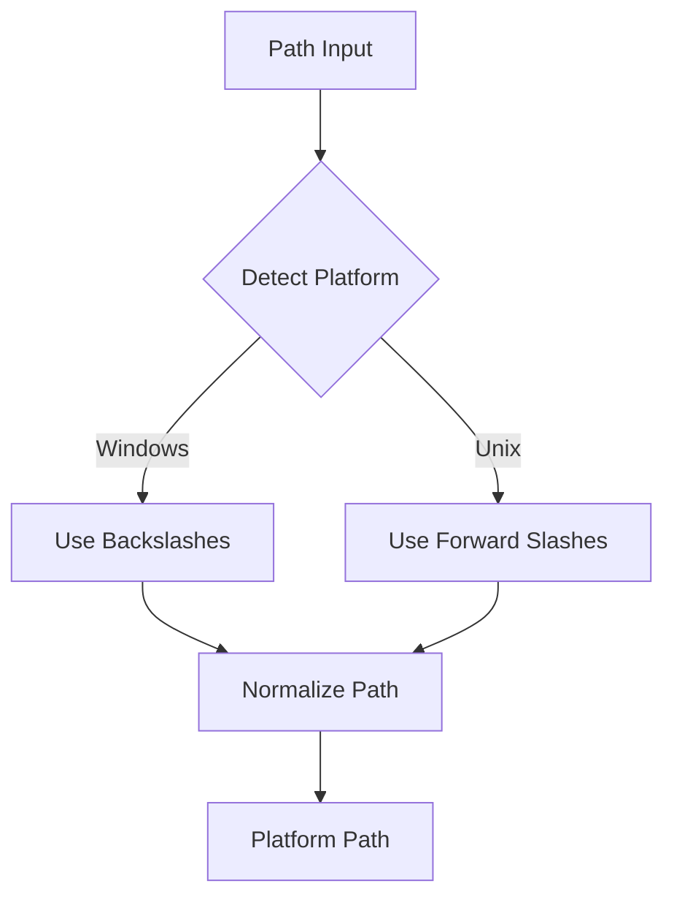

### 9.3 Shell Detection

```dart
enum Shell {
  bash,
  zsh,
  fish,
  powershell,
  cmd,
  nushell,
}

class ShellDetector {
  static Shell detect() {
    final shellEnv = Platform.environment['SHELL'];
    if (shellEnv != null) {
      if (shellEnv.contains('zsh')) return Shell.zsh;
      if (shellEnv.contains('bash')) return Shell.bash;
      if (shellEnv.contains('fish')) return Shell.fish;
    }
    if (Platform.isWindows) {
      return Shell.powershell;
    }
    return Shell.bash; // Default
  }
}
```

## 10. Security Considerations

### 10.1 Command Injection Prevention

```dart
class CommandValidator {
  static bool isSafe(String command) {
    // Reject commands that could escape context
    final dangerousPatterns = [
      RegExp(r'[;&|>`\$]'), // Shell metacharacters
      RegExp(r'\.\.'), // Path traversal
      RegExp(r'/\*'), // Wildcard abuse
    ];

    return !dangerousPatterns.any((pattern) => pattern.hasMatch(command));
  }
}
```

### 10.2 Path Validation

```dart
class PathValidator {
  static void validatePath(String path, String basePath) {
    final resolved = Directory(path).absolute.path;
    final baseResolved = Directory(basePath).absolute.path;

    if (!resolved.startsWith(baseResolved)) {
      throw SecurityException('Path outside base directory');
    }
  }
}
```

### 10.3 Config Validation

```dart
class ConfigValidator {
  static ValidationResult validate(Config config) {
    final errors = <String>[];

    // Validate timeout
    if (config.hooks.timeout < 1 || config.hooks.timeout > 3600) {
      errors.add('Hook timeout must be between 1 and 3600 seconds');
    }

    // Validate paths in copy config
    for (final pattern in config.copy.files) {
      if (!PatternValidator.isSafeGlob(pattern)) {
        errors.add('Unsafe glob pattern: $pattern');
      }
    }

    return errors.isEmpty
        ? ValidationResult.success()
        : ValidationResult.failure(errors);
  }
}
```

## 11. Performance Optimization

### 11.1 Copy-on-Write Detection

```dart
class CopyStrategySelector {
  static CopyStrategy selectStrategy() {
    final platform = PlatformDetector.current;
    final filesystem = detectFilesystem();

    switch (platform) {
      case Platform.macos:
        if (filesystem == Filesystem.apfs) {
          return CopyStrategy.cow;
        }
        break;
      case Platform.linux:
        if (filesystem == Filesystem.btrfs || filesystem == Filesystem.xfs) {
          return CopyStrategy.reflink;
        }
        break;
      default:
        return CopyStrategy.standard;
    }

    return CopyStrategy.standard;
  }
}

enum CopyStrategy {
  cow, // macOS APFS clone
  reflink, // Linux Btrfs/XFS reflink
  standard, // Traditional copy
}

enum Filesystem {
  apfs,
  btrfs,
  xfs,
  other,
}
```

### 11.2 Lazy Configuration Loading

```dart
class LazyConfigService {
  Config? _cachedGlobal;
  Config? _cachedRepo;
  Config? _cachedLocal;

  Future<Config> getGlobalConfig() async {
    _cachedGlobal ??= await _loadGlobalConfig();
    return _cachedGlobal!;
  }

  Future<Config> getRepoConfig() async {
    _cachedRepo ??= await _loadRepoConfig();
    return _cachedRepo!;
  }

// ...
}
```

## 12. Future Extensibility

### 12.1 Plugin System (Future)

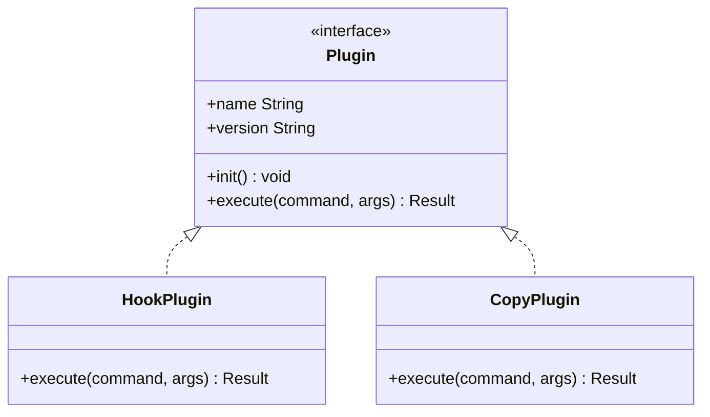

### 12.2 Remote Worktree Support (Future)

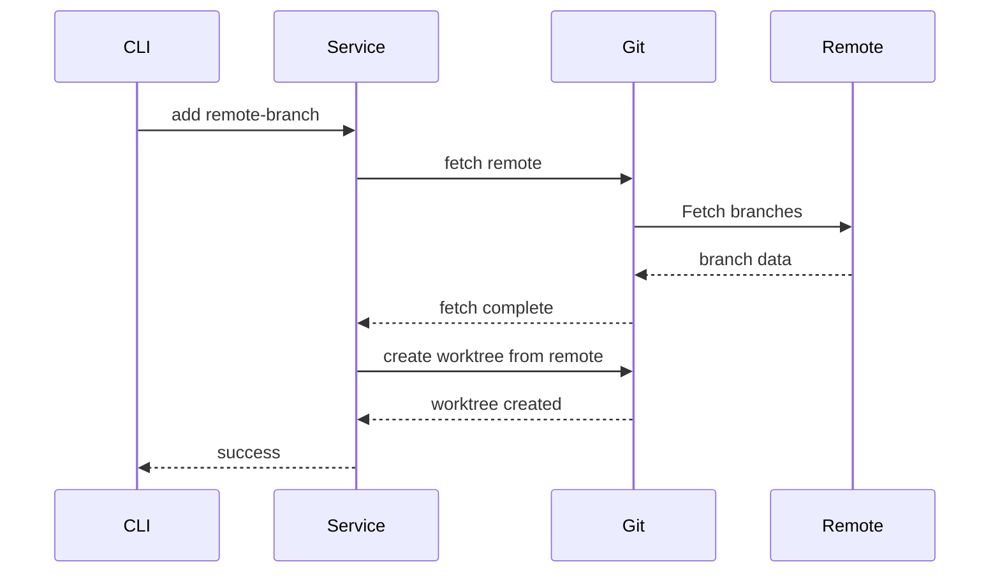

## 13. Summary

This architecture provides:

- **Clear separation of concerns** with layered architecture
- **Testability** through dependency injection and interfaces
- **Cross-platform support** with platform abstractions
- **Error handling** that preserves partial state with clear guidance
- **Performance** through CoW detection and lazy loading
- **Security** with input validation and path sanitization
- **Extensibility** for future features

The testing strategy ensures all error conditions are covered without invoking external tools, providing fast, reliable
tests across all platforms.
