# GWM Architecture Design Document

## 1. Overview

GWM (Git Worktree Manager) is a command-line tool built in Dart that simplifies Git worktree management. This document
outlines the software architecture, component design, data flows, and testing strategy.

## 2. Technology Stack

### 2.1 Dart SDK Built-ins

- `dart:io` - File system operations, process spawning, platform detection
- `dart:async` - Async operations and Future handling
- `dart:convert` - JSON encoding/decoding

## 2. Architecture Layers

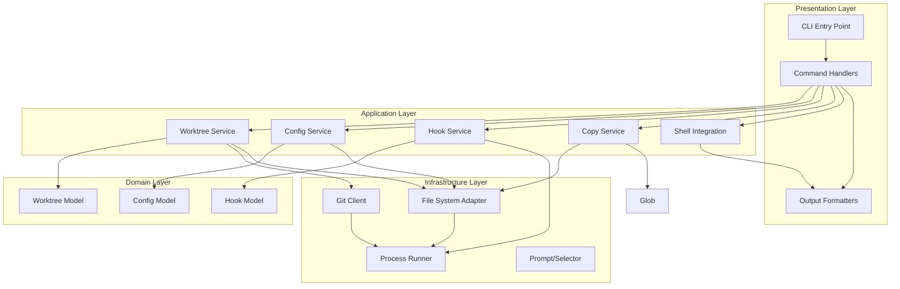

## 3. Directory Structure

```
gwm/
├── bin/
│   └── gwm.dart                  # Main CLI entry point
├── lib/
│   ├── src/
│   │   ├── commands/             # Command handlers
│   │   ├── services/             # Business logic
│   │   ├── models/               # Domain models
│   │   ├── infrastructure/       # External integrations
│   │   ├── utils/                # Utilities
│   │   └── exceptions.dart       # Custom exceptions
│   └── gwm.dart                  # Library entry point
├── test/
│   ├── unit/                     # Unit tests
│   ├── integration/              # Integration tests
│   ├── fixtures/                 # Test fixtures
│   └── mock_objects/             # Test doubles
└── docs/
    ├── PRD.md
    ├── ARCHITECTURE.md           # This file
    └── TESTING.md
```

## 4. Core Components

### 4.1 Command Handlers

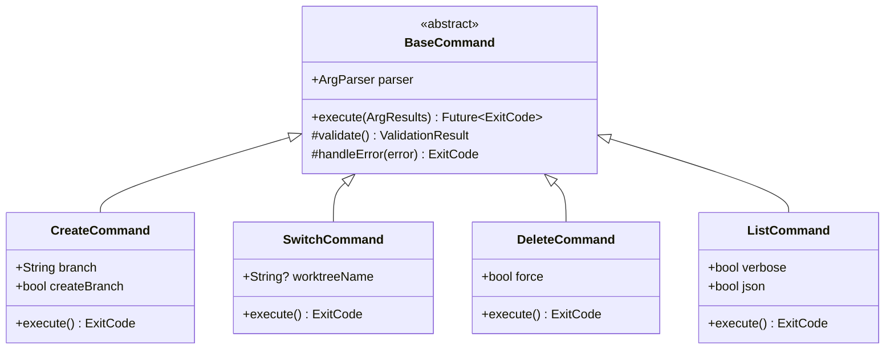

### 4.2 Worktree Service

The `WorktreeService` orchestrates worktree operations.

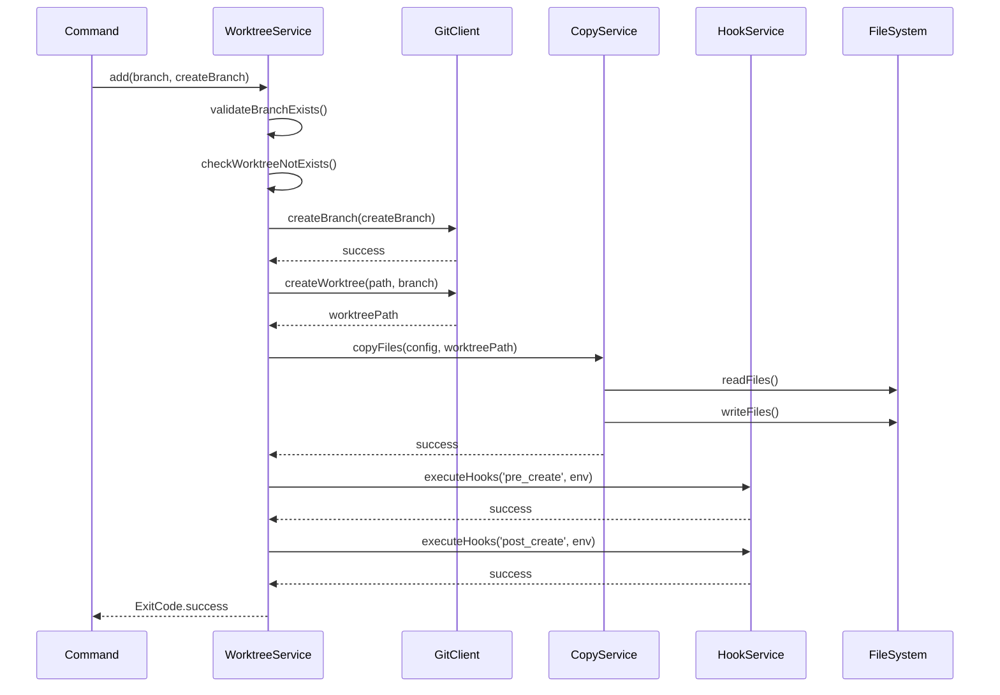

### 4.3 Configuration Service

The `ConfigService` manages configuration loading with the 3-tier hierarchy:

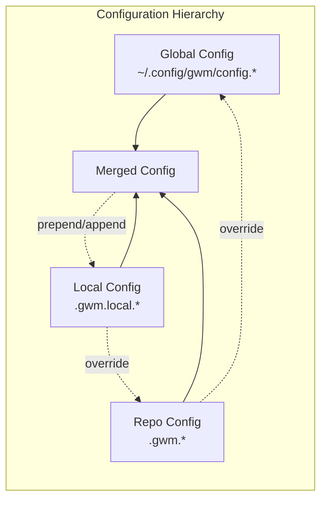

**Configuration Merging Logic:**

1. Load global config (lowest priority)
2. Load repo config, override global settings
3. Load local config, apply override strategies:
    - Direct field: Complete override
    - `_prepend`: Add items before existing list
    - `_append`: Add items after existing list

### 4.4 Hook Service

The `HookService` executes shell commands with proper error handling:

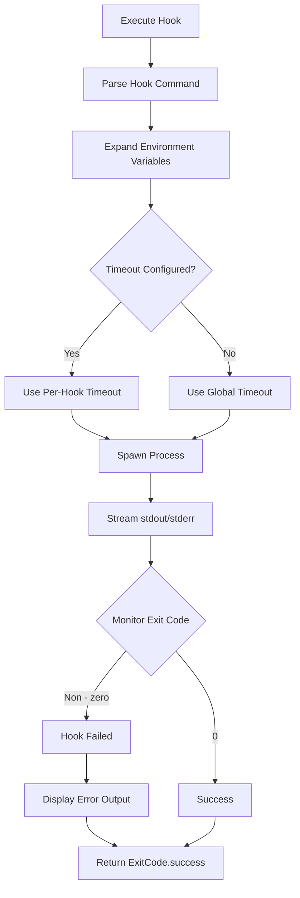

**Hook Execution Rules:**

- Execute commands sequentially
- Stop immediately on first failure
- Display all output (stdout + stderr)
- Terminate on timeout
- Exit with code 5 on failure

### 4.5 Copy Service

The `CopyService` handles file/directory copying with CoW optimization:

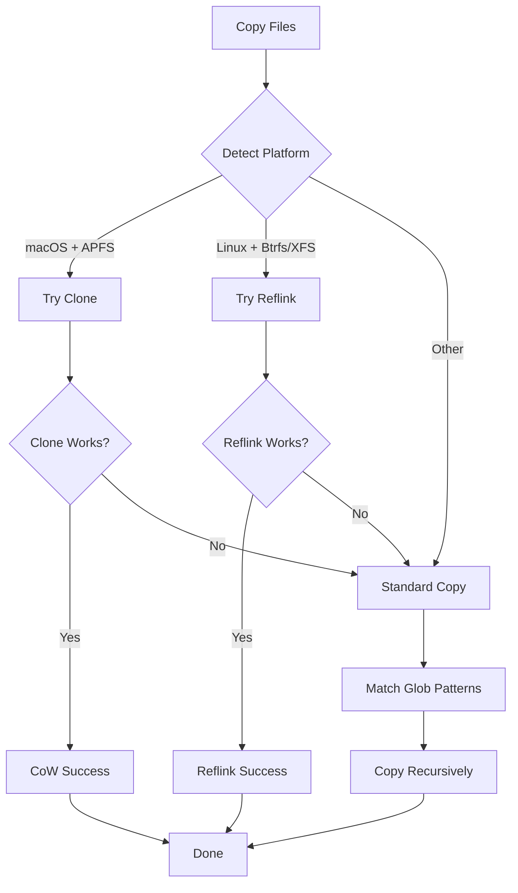

### 4.6 Git Client

The `GitClient` wraps all Git CLI operations:

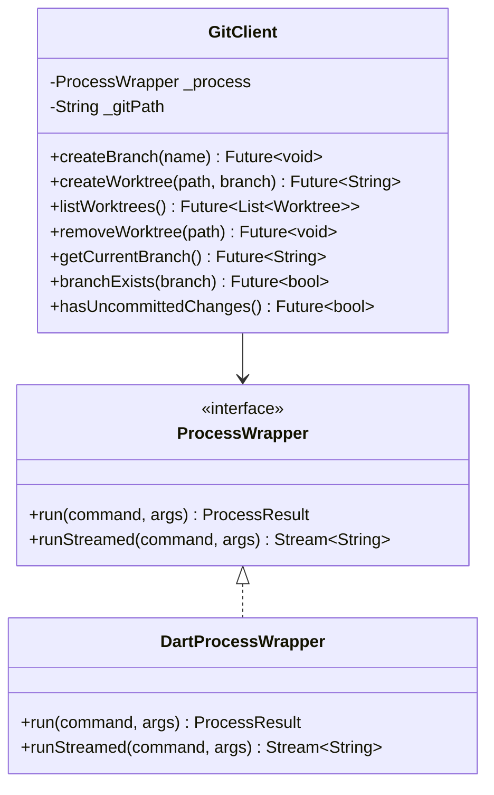

### 4.7 Shell Integration

Shell integration uses eval-output for directory switching:

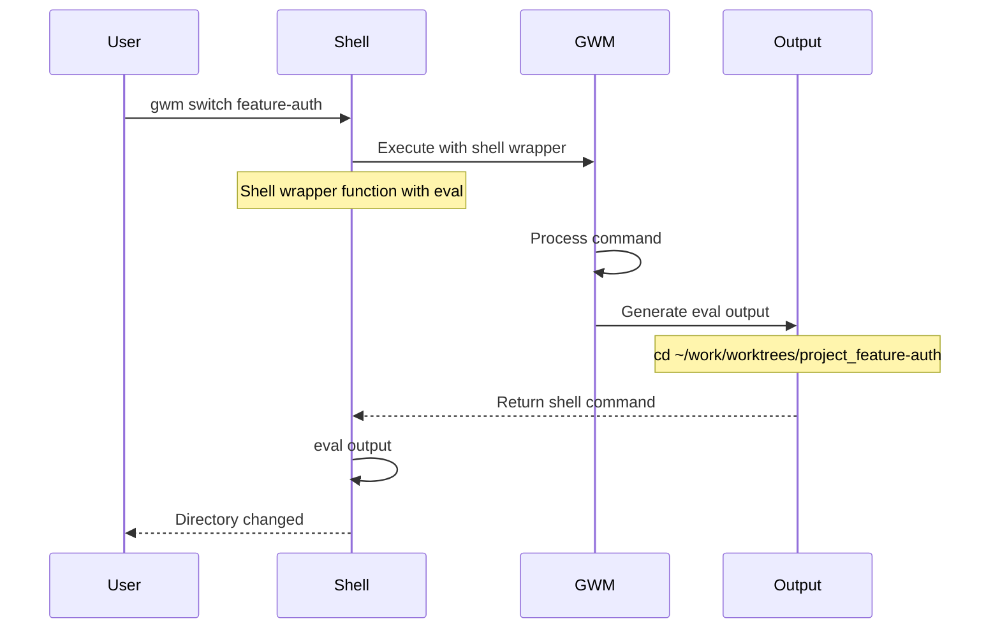

## 5. Data Models

### 6.1 Worktree Model

The Worktree model represents a Git worktree with properties for name, branch, path, status, and timestamps. See `lib/src/models/worktree.dart` for the complete class definition.

### 6.2 Configuration Model

The configuration system uses hierarchical loading with global, repo, and local configs. It includes settings for copy operations, hooks, and shell integration. See `lib/src/models/config.dart` for the complete configuration model definitions.

## 6. Error Handling

### 6.1 Error Handling Strategy

GWM uses a consistent error handling approach across all layers:

1. **Exception Hierarchy**: All errors inherit from `GwmException` with associated exit codes
2. **Infrastructure Layer**: Throws specific `GwmException` subclasses for domain-specific errors
3. **Service Layer**: May return `ExitCode` directly or throw `GwmException` depending on context
4. **Command Layer**: Always catches `GwmException` and converts to appropriate `ExitCode`
5. **Main Entry Point**: Handles uncaught exceptions with user-friendly messages

### 6.2 Exception Hierarchy

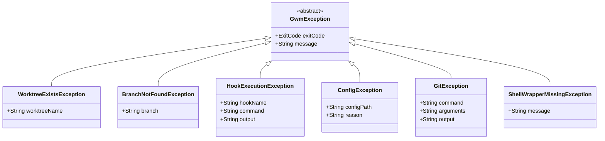

### 6.3 Error Handling Patterns by Layer

#### Infrastructure Layer (GitClient, FileSystemAdapter, etc.)
- **Throws**: Specific `GwmException` subclasses
- **Purpose**: Convert low-level errors to domain-specific exceptions
- **Example**:
```dart
// GitClientImpl.createWorktree()
if (result.exitCode != 0) {
  throw GitException('worktree', ['add', path, branch], result.stderr);
}
```

#### Service Layer (WorktreeService, ConfigService, etc.)
- **Returns**: `ExitCode` for success/failure indication
- **Throws**: `GwmException` for domain errors that should bubble up
- **Purpose**: Business logic with clear success/failure paths
- **Example**:
```dart
// WorktreeService.addWorktree()
try {
  // ... business logic
  return ExitCode.success;
} catch (e) {
  printSafe('Error: Failed to create worktree: $e');
  return ExitCode.gitFailed;
}
```

#### Command Layer (CreateCommand, SwitchCommand, etc.)
- **Returns**: `ExitCode` from `execute()` method
- **Catches**: `GwmException` and converts to appropriate exit codes
- **Purpose**: CLI interface with proper exit codes
- **Example**:
```dart
// CreateCommand.execute()
try {
  // ... command logic
} on ShellWrapperMissingException catch (e) {
  printSafe(e.message);
  return e.exitCode;
} catch (e) {
  printSafe('Error: Failed to create worktree: $e');
  return ExitCode.gitFailed;
}
```

#### Main Entry Point (bin/gwm.dart)
- **Catches**: All unhandled exceptions
- **Converts**: To user-friendly messages and exit codes
- **Purpose**: Final safety net with graceful degradation

### 6.4 Error Recovery Strategy

The PRD specifies: **Leave partial state with clear error message**

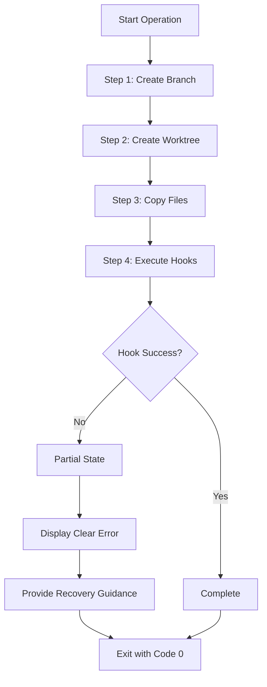

**Recovery Guidance Examples:**

- Hook failed: `npm install exited with status 1` → Run manually or fix issue and retry
- Git failed: `branch not found` → Use `-b` flag to create branch
- Copy failed: `Source file not found` → Check config and source path

## 7. Testing Strategy

### 7.1 Testing Philosophy

**Core Principle: Never invoke actual external tools in tests**

All tests use test doubles and mocks to ensure:

- Fast test execution
- Deterministic behavior
- Cross-platform test consistency
- No side effects on user environment

### 7.2 Test Pyramid

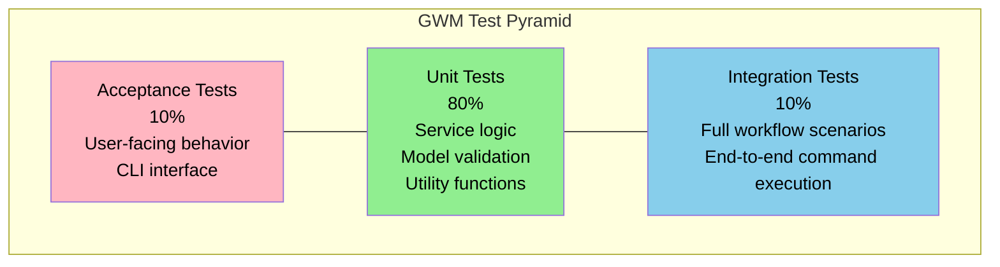

### 7.3 Unit Testing

Unit tests focus on individual components with mocked dependencies. External tools like Git and file system operations are mocked to avoid side effects.

### 7.4 Integration Testing

Integration tests verify end-to-end command workflows using fake implementations for all external dependencies.

### 7.5 Test Coverage Goals

| Component      | Target Coverage |
|----------------|-----------------|
| Commands       | 90%+            |
| Services       | 95%+            |
| Models         | 100%            |
| Infrastructure | 90%+            |
| Utils          | 95%+            |
| Overall        | 90%+            |

### 7.6 Running Tests

```bash
# Run all tests
dart test

# Run with coverage
dart test --coverage=coverage

# Run unit tests only
dart test test/unit/

# Run integration tests only
dart test test/integration/

# Run specific test
dart test test/unit/services/worktree_service_test.dart

# Run tests matching pattern
dart test -n "add worktree"
```

## 8. Cross-Platform Considerations

### 8.1 Platform Detection

Platform detection identifies the operating system to enable appropriate filesystem and process handling. See `lib/src/infrastructure/platform_detector.dart` for platform detection logic.

### 8.2 Path Handling

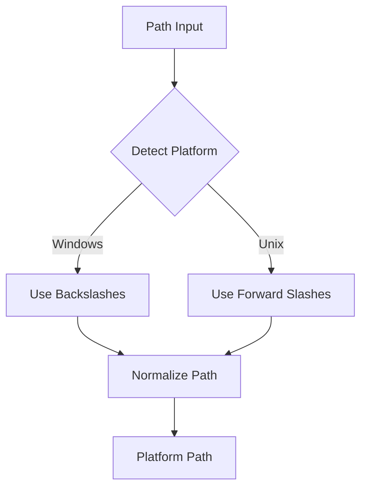

### 8.3 Shell Detection

Shell detection automatically identifies the user's shell environment for proper command execution. See `lib/src/utils/shell_detector.dart` for the shell detection implementation.

### 8.4 Prompt Selector

The prompt selector provides interactive user interfaces for selecting worktrees from lists. See `lib/src/infrastructure/prompt_selector.dart` for the prompt selector interface and implementation.

### 8.5 File System Adapter

The file system adapter abstracts file system operations to enable testing and cross-platform compatibility. See `lib/src/infrastructure/file_system_adapter.dart` for the interface and `lib/src/infrastructure/file_system_adapter_impl.dart` for the implementation.

## 9. Security Considerations

### 9.1 Command Injection Prevention

Input validation prevents command injection by rejecting dangerous shell metacharacters and path traversal attempts. See `lib/src/utils/validation.dart` for command validation logic.

### 9.2 Path Validation

Path validation ensures all file operations stay within allowed directories to prevent directory traversal attacks. See `lib/src/utils/validation.dart` for path validation utilities.

### 9.3 Config Validation

Configuration validation ensures all settings are within safe bounds, including timeout limits and safe glob patterns. See `lib/src/utils/validation.dart` for configuration validation logic.

## 10. Performance Optimization

### 10.1 Copy-on-Write Detection

Copy operations automatically detect filesystem capabilities to use efficient copy-on-write techniques where available (APFS clone on macOS, reflink on Linux). See `lib/src/services/copy_service.dart` for copy strategy selection.

### 10.2 Lazy Configuration Loading

Configuration loading uses lazy initialization and caching to minimize I/O operations during repeated access. See `lib/src/services/config_service.dart` for configuration loading implementation.

## 11. Eval Wrappers

### 11.1 Why Eval Wrappers Are Necessary

Command-line tools cannot directly modify the shell's current working directory. When a CLI application exits, any directory changes it made internally are lost. To enable persistent directory switching (as required for worktree management), GWM uses eval wrappers that output shell commands which are then executed by the shell itself.

Without eval wrappers, commands like `gwm switch feature-branch` would change directories temporarily within the GWM process but immediately return the user to their original directory upon completion. Eval wrappers solve this by having GWM output commands like `cd /path/to/worktree` that the shell then executes in its own context.

### 11.2 How Eval Wrapping Works

Eval wrapping operates through a shell function or alias that captures GWM's output and evaluates it:

```bash
# Example shell function wrapper
gwm() {
  # Execute gwm and capture its output
  local output
  output=$(command gwm "$@")

  # Check exit code
  local exit_code=$?

  # If successful and output contains shell commands, eval them
  if [[ $exit_code -eq 0 && -n "$output" ]]; then
    eval "$output"
  fi

  # Return the original exit code
  return $exit_code
}
```

**Process Flow:**

1. User runs `gwm switch feature-auth`
2. Shell executes the wrapper function instead of gwm directly
3. Wrapper calls actual gwm binary and captures output
4. GWM processes the command and outputs shell commands (e.g., `cd ~/worktrees/project_feature-auth`)
5. Wrapper evaluates the output, changing the shell's directory
6. User remains in the new directory after command completion

### 11.3 Manual Configuration Requirement

Eval wrappers require manual installation because:

**Shell-Specific Configuration:** Different shells (bash, zsh, fish, etc.) have different syntax for functions and aliases. The wrapper must be written in the appropriate shell syntax and added to the correct configuration file (.bashrc, .zshrc, .config/fish/config.fish).

**Security Considerations:** Automatically modifying shell configuration files could introduce security risks. Manual installation ensures users review and understand what code is being added to their shell environment.

**User Choice:** Not all users may want directory switching functionality, or they may prefer alternative integration methods. Manual configuration allows users to opt-in to this feature.

**Installation Process:**

1. User runs `gwm shell init` to generate appropriate wrapper code
2. User manually adds the generated code to their shell configuration file
3. User restarts shell or sources the configuration file
4. Wrapper becomes active for future gwm commands

This approach provides flexibility while ensuring users maintain control over their shell environment.

